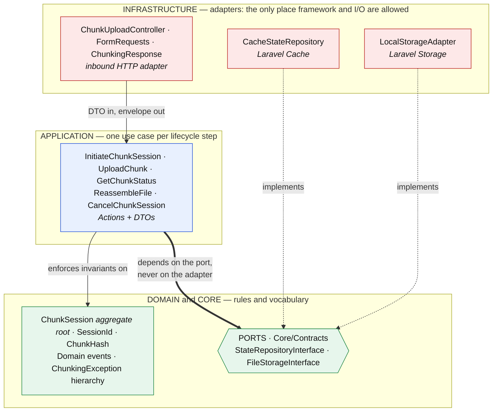
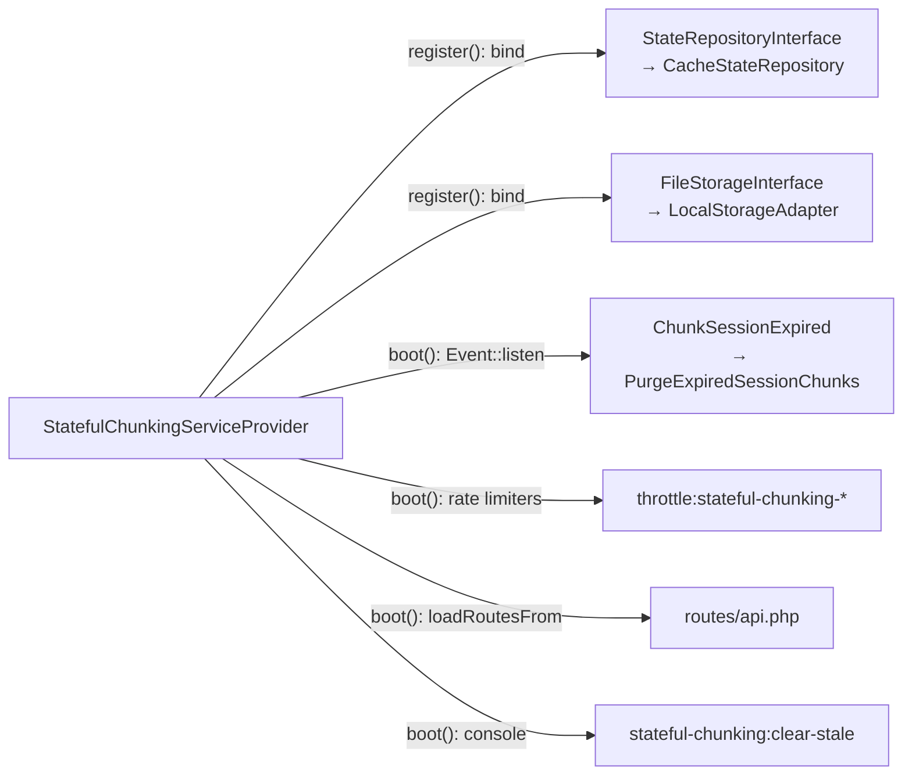

# Architecture: layers, ports and seams

This directory documents **how the package works at runtime** — the missing third of
its documentation. The other two already existed:

| Directory | Answers | Audience |
| :--- | :--- | :--- |
| `docs/decisions/` | *Why* is it built this way? | Anyone changing a decision |
| `docs/audits/` (private) | *What* broke, and how it was proven | Security review |
| **`docs/architecture/`** | ***How* do the pieces connect?** | Anyone changing code |

The gap was not cosmetic. Four rounds of security hardening closed twelve
vulnerabilities inside individual controls, yet the findings that survived all four
rounds were **seam defects**: two layers making different assumptions about the same
value. A seam defect is invisible when you read one file at a time, and obvious the
moment the boundaries are drawn. That is what these three documents are for.

- **This file** — the layer graph, the dependency rule, and the ports.
- **[`request-lifecycle.md`](request-lifecycle.md)** — each endpoint end to end, with
  the exact point where authorization happens.
- **[`data-transformations.md`](data-transformations.md)** — where every input is
  validated, where it is normalised, and where it starts being trusted. Read this one
  before touching validation or authorization.

---

## The layer graph



The two dotted arrows are the whole point of the shape. `CacheStateRepository` and
`LocalStorageAdapter` know about the interfaces; the interfaces know nothing about
them. That inversion is what lets the state store be Redis, database, file or
DynamoDB, and the staging disk be swapped, without a line changing inside the core.

## The dependency rule

```
Infrastructure  ───►  Application  ───►  Domain / Core
```

Never the reverse. Concretely:

- Nothing under `Domain/` or `Application/` may `use`, type-hint, or reference a class
  under `Infrastructure/`.
- Nothing under `Domain/` or `Application/` may reach for `Storage::`, `Cache::`,
  `DB::`, `Http::`, `request()`, or an Eloquent model.
- An Action talks to `StateRepositoryInterface`, never to `CacheStateRepository`.

These three bullets are **not** prose: `tests/Unit/Architecture/LayerDependencyRuleTest.php`
walks the inner layers' imports and fails CI when a new one appears. That matters more
than it sounds — a rule that lives only in a document gets quietly amended the next time
the code contradicts it, at which point it has stopped being a rule.

**Named pragmatic exceptions** — deliberate choices, listed here so the next reader does
not have to guess, and mirrored in the test's allowlist:

| Exception | Where | Why it is tolerated |
| :--- | :--- | :--- |
| `Crypt` facade | `Core/Services/StatefulChunkingService` | The upload token is authenticated encryption keyed by the app's `APP_KEY`. Re-implementing the cipher and MAC to avoid a facade would trade a real security property for a structural one. |
| `config()` helper | Actions, adapters, request rules | Configuration is ambient. Injecting it everywhere would add constructor noise across the package for no testability gain — tests already override it with `Config::set()`. |
| `Dispatchable`, `SerializesModels` | all four `Domain/Events/*` | The events exist to be consumed by the host application's listeners, so being Laravel events is the point. **This one has already cost us**: Laravel 10/11's `Dispatchable::dispatch()` forwards through `func_get_args()`, which silently drops named arguments and broke every `/complete` call on those versions until `ReassembleFileAction` switched to positional args. Dispatch domain events positionally. |
| `Log` facade, `JsonResponse`, `Responsable` | `Domain/Exceptions/ChunkingException` | The hierarchy exists to render and audit itself so the HTTP layer carries no `try`/`catch`. That requires knowing how to render a response and where to log — so the Domain layer does perform log I/O, by design. |
| `Str` | `Core/ValueObjects/SessionId` | UUID generation only. |

A coupling belongs in this table only when somebody chose it **for a reason**. One that
nobody chose is not an exception, it is debt, and it goes under
[Observed structural debt](#observed-structural-debt) instead — where it stays visible
until it is removed, rather than being laundered into a documented allowance.

## Ports

| Port | Kind | The core says | The adapter knows |
| :--- | :--- | :--- | :--- |
| `StateRepositoryInterface` | driven (outbound) | "persist this session", "lock this session" | Laravel Cache, per-driver locking, TTL, lazy expiry |
| `FileStorageInterface` | driven (outbound) | "store this chunk", "reassemble this file" | Laravel Storage, streams, temp paths |
| `PrunableChunkStorageInterface` | driven (outbound), **optional** | "which staging directories are abandoned?" | directory listing, file mtimes and sizes |
| The five Actions | driving (inbound) | — | the controller invokes them |

`PrunableChunkStorageInterface` is deliberately **not** part of `FileStorageInterface`.
Sweeping the staging area is a maintenance capability, not a step of the upload
lifecycle, and an adapter that cannot list its own directories is still a valid storage
adapter. Merging the two would force every consumer with a custom adapter to implement
methods it has no use for, and the usual result of that is a stub that throws — the
substitutability failure the segregated port exists to prevent. Callers check for it
with `instanceof` and degrade with a warning.

Port methods speak the domain's language (`saveSession`, `reassembleFile`), never the
technology's (`redisSet`, `putObject`). Adding a backend means implementing a port and
binding it; it never means editing the core.

## Composition root



`StatefulChunkingServiceProvider` is the **only** place that knows both sides of a
port. A `new CacheStateRepository(...)` or a container binding anywhere else is a bug:
swapping an adapter must stay a one-line change here.

## Public surface for the consuming application

Three entry points sit outside the module structure on purpose — they are the
package's API for the host app, not internals:

| Class | Purpose |
| :--- | :--- |
| `Facades\StatefulChunking` | `generateToken()` / `resolveToken()` without touching the container |
| `Rules\ValidUploadToken` | a Laravel validation rule the consumer puts on its own FormRequest |
| `Core\Services\StatefulChunkingService` | the concrete service behind both |

The intended integration is the **staged upload pattern**: the package returns an
opaque `upload_token`, the consumer validates it with `ValidUploadToken`, resolves it
to a `StagedFileDTO`, and moves the assembled file to its permanent home. The response
carries no server path unless `expose_server_paths` is switched on — that flag is the
single control standing between the consumer and a filesystem disclosure, so treat it as
security configuration rather than a debugging convenience. See the README's *Backend
Consumer Integration Guide*.

---

## Observed structural debt

Three things no security audit would flag, because none is exploitable. Recorded here
rather than fixed, so they are a decision and not an oversight:

1. **`Core/Services/StatefulChunkingService` imports `Application/DTOs/StagedFileDTO`**
   (`src/Core/Services/StatefulChunkingService.php:8`). Core depending on Application
   is an inward-pointing violation of the rule above. `StagedFileDTO` is the natural
   return type of `resolveToken()`, so the fix is to move the DTO inward (into `Core/`)
   rather than to change the signature — and because it is part of the consumer-facing
   surface, that move needs a compatibility alias.

2. **The `ChunkSize` value object is never used.** The concept it models is read
   straight from `config('stateful-chunking.chunk_size_bytes')` in three places
   instead, each repeating the same defensive
   `is_numeric(...) ? (int) ... : 2097152` dance, in `ChunkUploadController::upload()`,
   `InitiateChunkRequest::rules()` and `UploadChunkRequest::rules()`. A value object
   exists precisely to hold that validation once.

3. **`Application/DTOs/StagedFileDTO::mimeType()` calls `Storage::disk(...)`**
   (`src/Modules/Chunking/Application/DTOs/StagedFileDTO.php:8,36`). This breaks the
   second bullet of the dependency rule above, verbatim. It is listed here and **not**
   in the exceptions table on purpose: nobody decided that an Application-layer DTO
   should do filesystem I/O, so amending the rule to accommodate it would launder a leak
   into an allowance. The fix belongs in the code — move the lookup behind
   `FileStorageInterface`, or have the consumer inspect the file it resolved. Until then
   the layer test carries it as a named, shrinking debt entry rather than as a silent
   pass.
