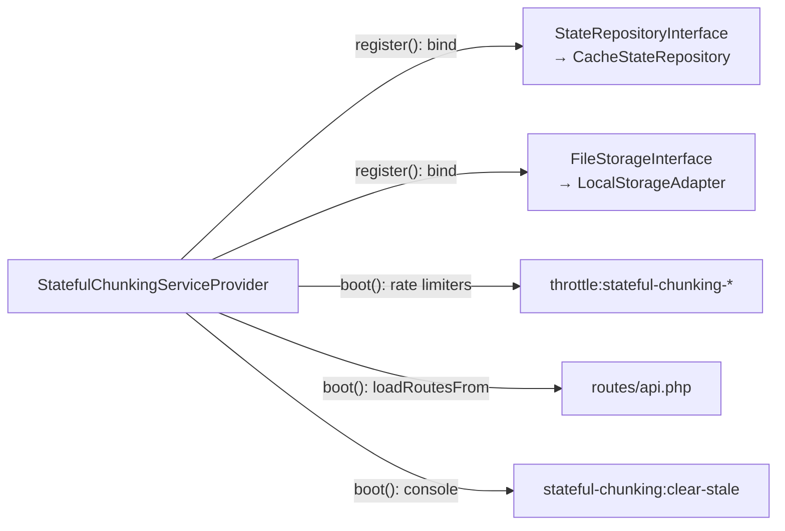

# Architecture: layers, ports and seams

This directory documents **how the package works at runtime** — the missing third of
its documentation. The other two already existed:

| Directory | Answers | Audience |
| :--- | :--- | :--- |
| `docs/decisions/` | *Why* is it built this way? | Anyone changing a decision |
| `docs/audits/` (private) | *What* broke, and how it was proven | Security review |
| **`docs/architecture/`** | ***How* do the pieces connect?** | Anyone changing code |

The gap was not cosmetic. Four rounds of security hardening closed twelve
vulnerabilities inside individual controls, yet the findings that survived all four
rounds were **seam defects**: two layers making different assumptions about the same
value. A seam defect is invisible when you read one file at a time, and obvious the
moment the boundaries are drawn. That is what these three documents are for.

- **This file** — the layer graph, the dependency rule, and the ports.
- **[`request-lifecycle.md`](request-lifecycle.md)** — each endpoint end to end, with
  the exact point where authorization happens.
- **[`data-transformations.md`](data-transformations.md)** — where every input is
  validated, where it is normalised, and where it starts being trusted. Read this one
  before touching validation or authorization.

---

## The layer graph


The two dotted arrows are the whole point of the shape. `CacheStateRepository` and
`LocalStorageAdapter` know about the interfaces; the interfaces know nothing about
them. That inversion is what lets the state store be Redis, database, file or
DynamoDB, and the staging disk be swapped, without a line changing inside the core.

## The dependency rule

```
Infrastructure  ───►  Application  ───►  Domain / Core
```

Never the reverse. Concretely:

- Nothing under `Domain/` or `Application/` may `use`, type-hint, or reference a class
  under `Infrastructure/`.
- Nothing under `Domain/` or `Application/` may reach for `Storage::`, `Cache::`,
  `DB::`, `Http::`, `request()`, or an Eloquent model.
- An Action talks to `StateRepositoryInterface`, never to `CacheStateRepository`.

**Named pragmatic exceptions** — deliberate choices, not leaks, listed here so the
next reader does not have to guess:

| Exception | Where | Why it is tolerated |
| :--- | :--- | :--- |
| `Crypt` facade | `Core/Services/StatefulChunkingService` | The upload token is authenticated encryption keyed by the app's `APP_KEY`. Re-implementing AES-256-CBC + HMAC to avoid a facade would trade a real security property for a structural one. |
| `config()` helper | Actions, adapters, request rules | Configuration is ambient. Injecting it everywhere would add constructor noise across the package for no testability gain — tests already override it with `Config::set()`. |

## Ports

| Port | Kind | The core says | The adapter knows |
| :--- | :--- | :--- | :--- |
| `StateRepositoryInterface` | driven (outbound) | "persist this session", "lock this session" | Laravel Cache, per-driver locking, TTL, lazy expiry |
| `FileStorageInterface` | driven (outbound) | "store this chunk", "reassemble this file" | Laravel Storage, streams, temp paths |
| The five Actions | driving (inbound) | — | the controller invokes them |

Port methods speak the domain's language (`saveSession`, `reassembleFile`), never the
technology's (`redisSet`, `putObject`). Adding a backend means implementing a port and
binding it; it never means editing the core.

## Composition root



`StatefulChunkingServiceProvider` is the **only** place that knows both sides of a
port. A `new CacheStateRepository(...)` or a container binding anywhere else is a bug:
swapping an adapter must stay a one-line change here.

## Public surface for the consuming application

Three entry points sit outside the module structure on purpose — they are the
package's API for the host app, not internals:

| Class | Purpose |
| :--- | :--- |
| `Facades\StatefulChunking` | `generateToken()` / `resolveToken()` without touching the container |
| `Rules\ValidUploadToken` | a Laravel validation rule the consumer puts on its own FormRequest |
| `Core\Services\StatefulChunkingService` | the concrete service behind both |

The intended integration is the **staged upload pattern**: the package returns an
opaque `upload_token`, the consumer validates it with `ValidUploadToken`, resolves it
to a `StagedFileDTO`, and moves the assembled file to its permanent home. The consumer
never receives a server path. See the README's *Backend Consumer Integration Guide*.

---

## Observed structural debt

Drawing the graph surfaced two things no security audit would flag, because neither is
exploitable. Recorded here rather than fixed, so they are a decision and not an
oversight:

1. **`Core/Services/StatefulChunkingService` imports `Application/DTOs/StagedFileDTO`**
   (`src/Core/Services/StatefulChunkingService.php:8`). Core depending on Application
   is an inward-pointing violation of the rule above. `StagedFileDTO` is the natural
   return type of `resolveToken()`, so the fix is to move the DTO inward (into `Core/`)
   rather than to change the signature — and because it is part of the consumer-facing
   surface, that move needs a compatibility alias.

2. **The `ChunkSize` value object is never used.** The concept it models is read
   straight from `config('stateful-chunking.chunk_size_bytes')` in three places
   instead, each repeating the same defensive
   `is_numeric(...) ? (int) ... : 2097152` dance: `ChunkUploadController:149`,
   `InitiateChunkRequest:112`, `UploadChunkRequest:26`. A value object exists precisely
   to hold that validation once.
