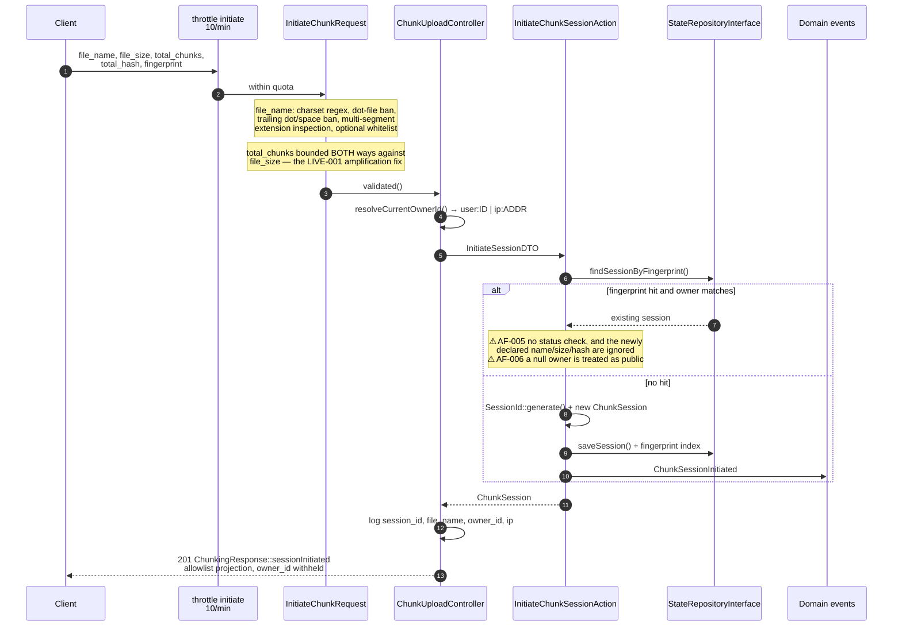
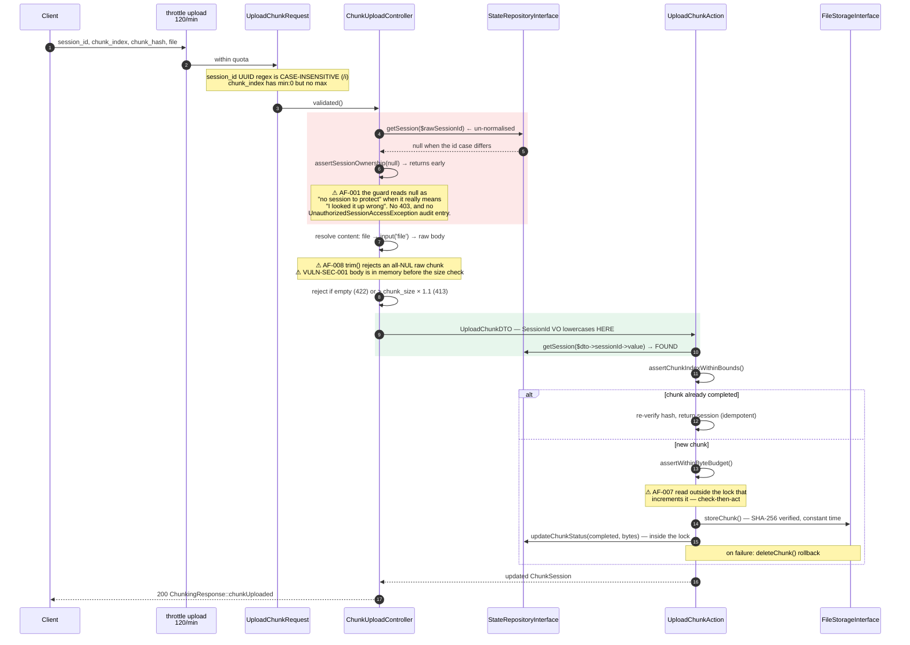
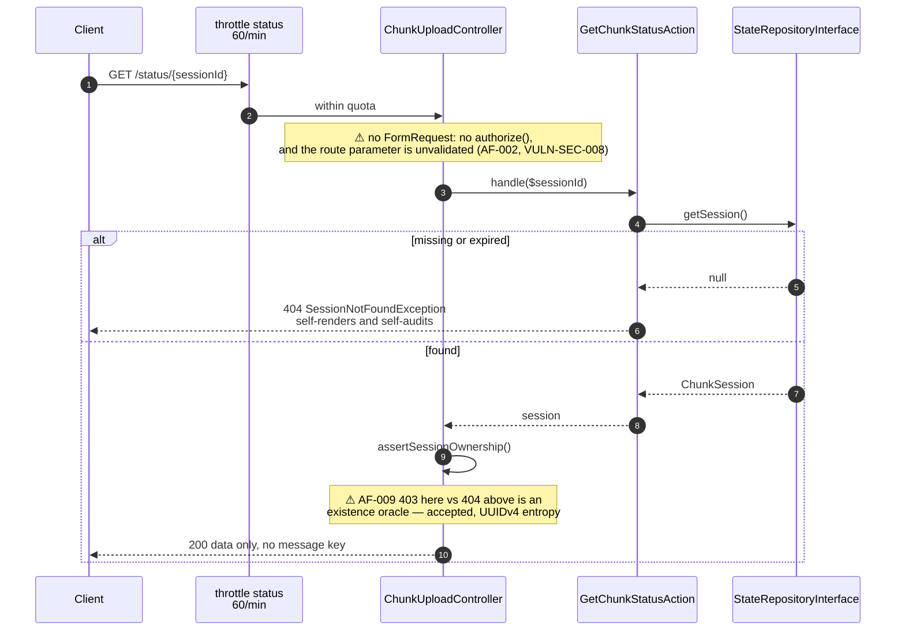
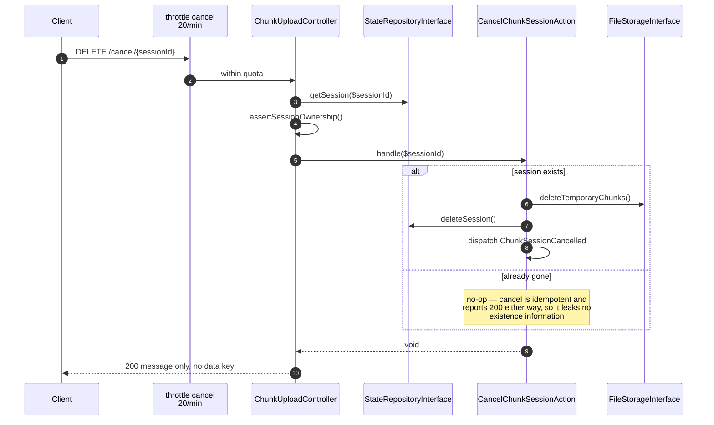
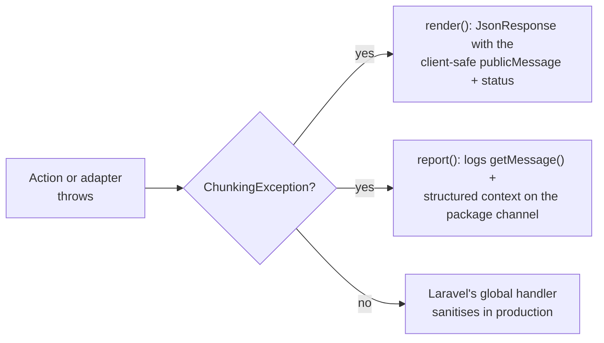

# Request lifecycle: the five endpoints

One sequence diagram per endpoint, each annotated with **the exact point where the
authorization decision is made**. That annotation is the reason this document exists:
the package's ownership guard is correct in isolation, and what breaks it is *when* it
runs relative to validation and normalisation.

> **State of this document**: describes `main` at `3233508`, *before* the AF-001…AF-010
> remediation. Steps marked **⚠** are known-open findings from
> `docs/audits/scans/2026-09-08_final_offensive_audit.md`; each remediation PR updates
> the affected diagram. See [`data-transformations.md`](data-transformations.md) for the
> per-value view of the same seams.

## Authorization at a glance

| Endpoint | Input validated by | Session id validated? | Authorization point | Verdict |
| :--- | :--- | :---: | :--- | :--- |
| `POST /initiate` | `InitiateChunkRequest` | n/a (generated) | fingerprint reuse decides whether you are handed an existing session | ⚠ AF-005, AF-006 |
| `POST /upload` | `UploadChunkRequest` | yes, regex `/i` | `assertSessionOwnership()` on the **raw** id, before normalisation | ⚠ **AF-001 bypass** |
| `GET /status/{id}` | nothing | **no** | `assertSessionOwnership()` after the Action already resolved it | ⚠ AF-002, AF-009 |
| `POST /complete` | inline `required\|string` | **no** | `assertSessionOwnership()` on the raw id | ⚠ AF-002, AF-010 |
| `DELETE /cancel/{id}` | nothing | **no** | `assertSessionOwnership()` on the raw id | ⚠ AF-002, AF-010 |

Every route additionally carries its own rate limiter
(`throttle:stateful-chunking-<op>`) plus the group middleware from
`config('stateful-chunking.routes.middleware')`, which defaults to `['api']`.

---

## 1. `POST /initiate`

## 2. `POST /upload` — the seam that AF-001 exploits

The two shaded blocks are the defect. The ownership decision happens in the red block
against the raw string; the normalisation that makes the lookup succeed happens in the
green block, afterwards. **The invariant PR 1 installs**: the identifier is normalised
exactly once, at the adapter boundary, *before* any authorization decision.

## 3. `GET /status/{sessionId}`

## 4. `POST /complete`

## 5. `DELETE /cancel/{sessionId}`

---

## How failures are rendered

The controller carries **no** `try`/`catch`. That is deliberate and it is what keeps it
a thin adapter:

Each subclass fixes its own HTTP status and its own public message. The detailed
message and the context array are **server-side only** — they feed the log, never the
response body. Adding a failure mode means adding a subclass, not an `if` in the
controller.

| Exception | Status |
| :--- | :---: |
| `SessionNotFoundException` | 404 |
| `UnauthorizedSessionAccessException` | 403 |
| `SessionNotReadyException` | 409 |
| `ChunkIntegrityException` | 422 |
| `ChunkIndexOutOfBoundsException` | 422 |
| `UploadBudgetExceededException` | 413 |
| `StorageFailureException` | 500 |

The two request-shape guards in the controller (empty payload, oversized payload) are
*not* domain failures, so they return `ChunkingResponse::inputError()` instead — a
message-only envelope. That distinction is the line between "your request is malformed"
and "your request is well-formed but the domain refuses it".
