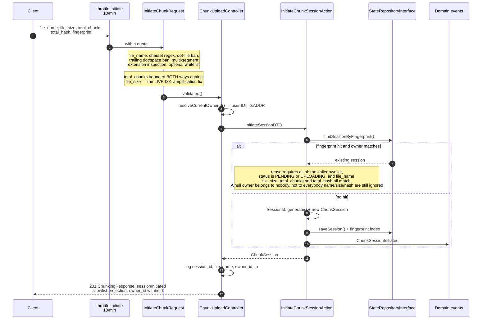
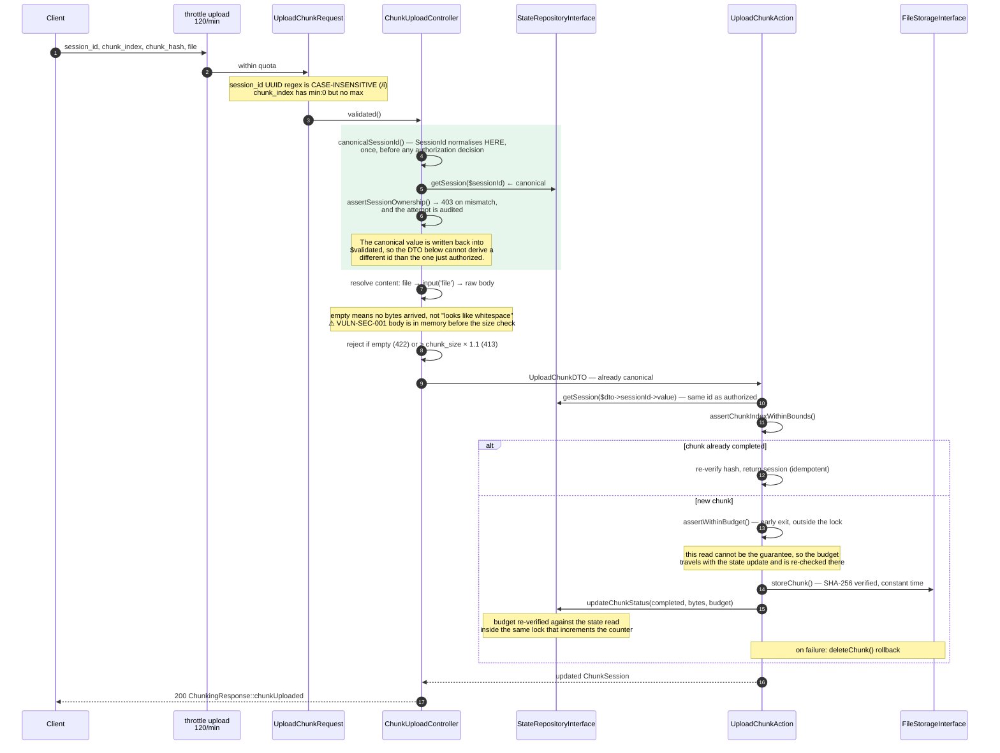
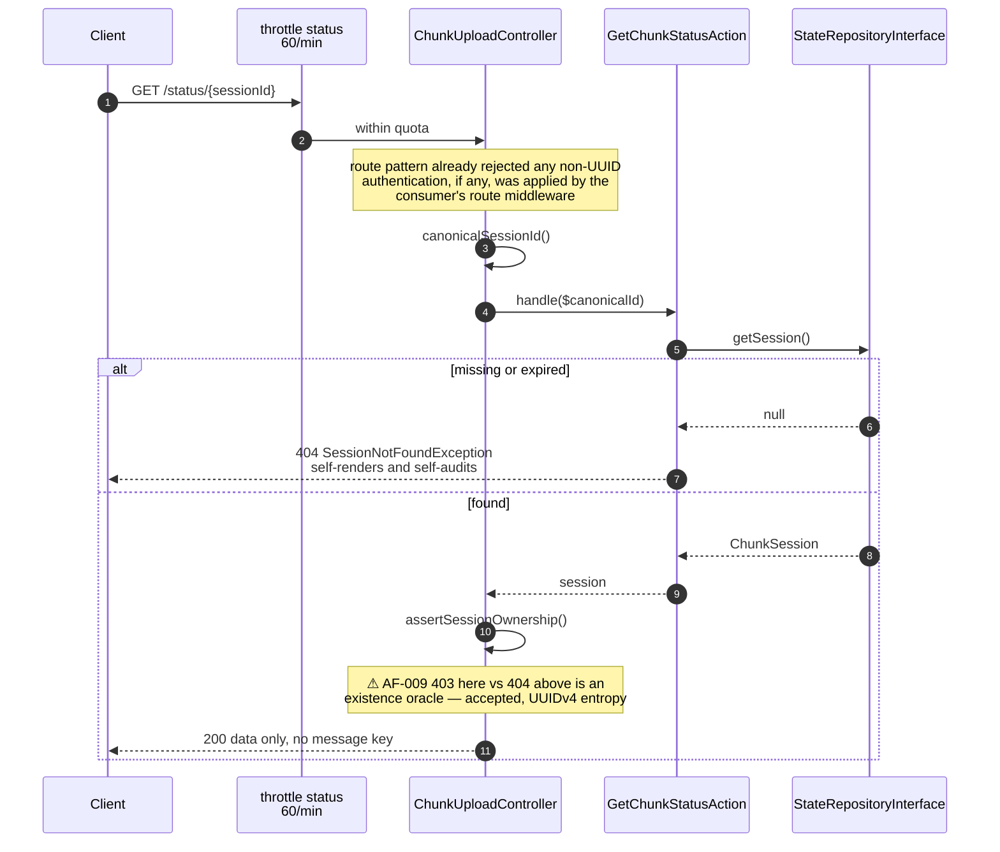
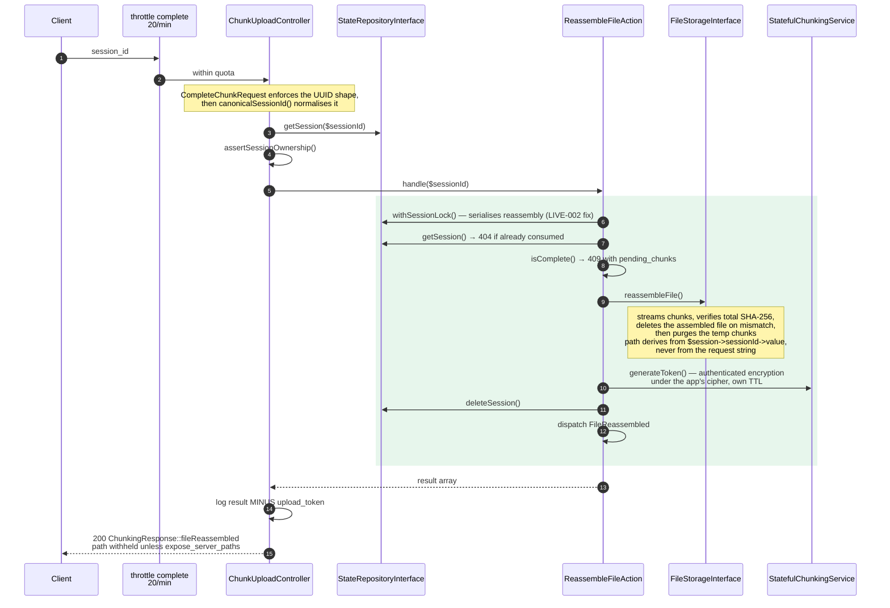
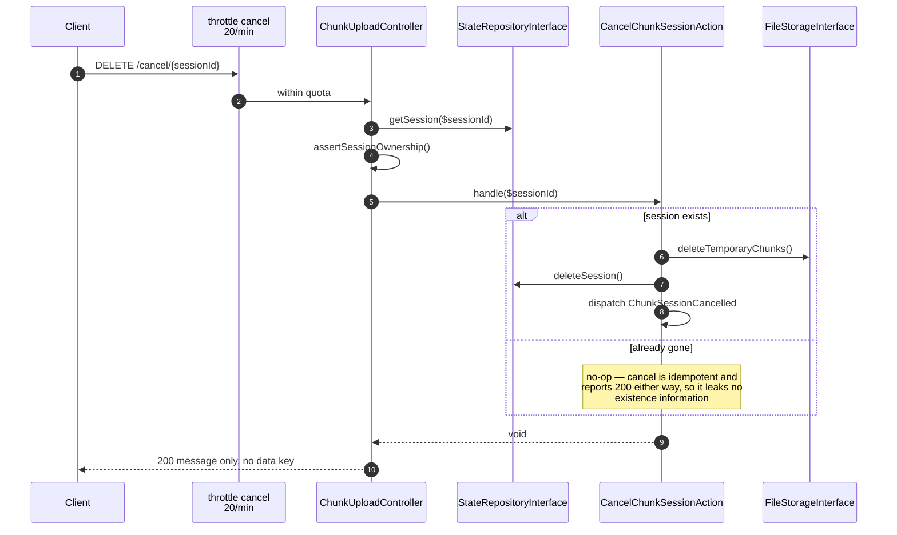
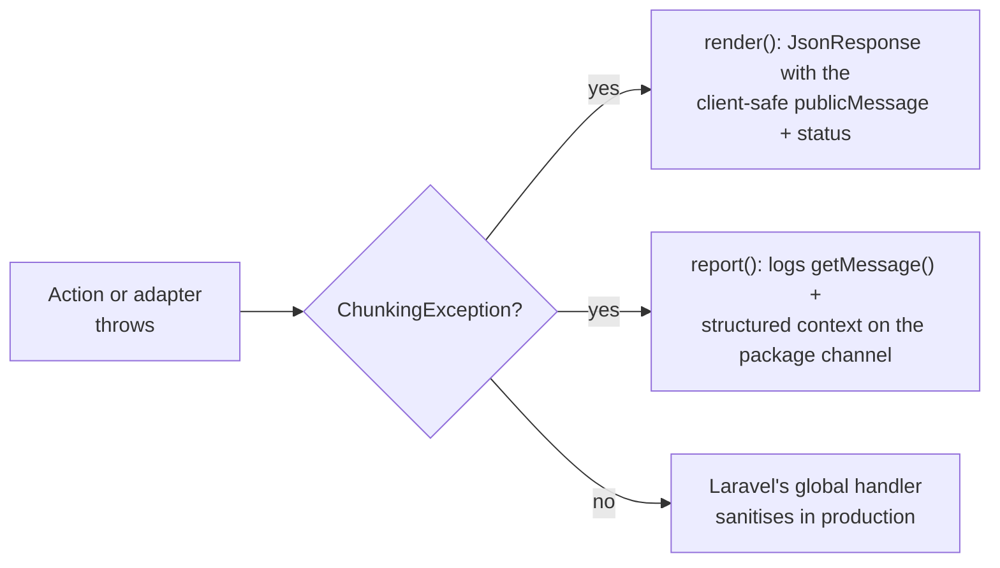

# Request lifecycle: the five endpoints

One sequence diagram per endpoint, each annotated with **the exact point where the
authorization decision is made**. That annotation is the reason this document exists:
the package's ownership guard is correct in isolation, and what breaks it is *when* it
runs relative to validation and normalisation.

> **State of this document**: every audit finding annotated here is **resolved**, except
> AF-009, which the audit itself recorded as a note rather than an action. See
> [ADR-0003](../decisions/0003-normalise-identity-at-the-adapter-boundary.md). Steps
> still marked **⚠** are accepted risks, named in place; each PR that changes behaviour
> updates the diagrams it touches. Finding identifiers refer to the private security
> review under `docs/audits/`, which is not published with the package. See
> [`data-transformations.md`](data-transformations.md) for the per-value view of the
> same seams.

## Authorization at a glance

Every endpoint that accepts a session identifier canonicalises it **first**, through
`ChunkUploadController::canonicalSessionId()`, and only then makes an authorization
decision. That ordering is the invariant ADR-0003 installs: before it, the guard ran on
the raw request value while the DTO normalised it afterwards, and the disagreement was a
bypass.

| Endpoint | Input validated by | Session id validated? | Authorization point | Verdict |
| :--- | :--- | :---: | :--- | :--- |
| `POST /initiate` | `InitiateChunkRequest` | n/a (generated) | fingerprint reuse, gated on owner, status and declaration | resolved |
| `POST /upload` | `UploadChunkRequest` | yes, UUID regex | on the **canonical** id, before the DTO | ok |
| `GET /status/{id}` | route pattern | yes, route pattern | after the Action resolved it | ⚠ AF-009 |
| `POST /complete` | `CompleteChunkRequest` | yes, UUID regex | on the canonical id | ok |
| `DELETE /cancel/{id}` | route pattern | yes, route pattern | on the canonical id | ok |

Every route carries the group middleware from
`config('stateful-chunking-upload.routes.middleware')`, which defaults to `['api']`, and — **only
while `rate_limits.enabled` is true** — its own limiter, `throttle:stateful-chunking-upload-<op>`.
That flag is worth knowing about: the limiter is the mitigating control several accepted
audit findings lean on to bound storage amplification and orphan-chunk accumulation to a
throughput rather than an unbounded quantity. Turning it off does not just relax a quota,
it removes that bound.

---

## 1. `POST /initiate`

## 2. `POST /upload` — the seam AF-001 exploited

The shaded block is where the defect used to live. Normalisation and the ownership
decision now happen there together, in that order, and everything downstream is handed
the same value. Previously the decision was made in that position against the raw string
while `SessionId` normalised it two steps later, inside the DTO — so an upper-case UUID
missed the guarded cache lookup, the guard read `null` as "no session to protect", and
the Action then found the victim's session anyway.

## 3. `GET /status/{sessionId}`

## 4. `POST /complete`

## 5. `DELETE /cancel/{sessionId}`

---

## How failures are rendered

The controller carries **no** `try`/`catch`. That is deliberate and it is what keeps it
a thin adapter:

Each subclass fixes its own HTTP status and its own public message. The detailed
message and the context array are **server-side only** — they feed the log, never the
response body. Adding a failure mode means adding a subclass, not an `if` in the
controller.

| Exception | Status |
| :--- | :---: |
| `SessionNotFoundException` | 404 |
| `UnauthorizedSessionAccessException` | 403 |
| `SessionNotReadyException` | 409 |
| `ChunkIntegrityException` | 422 |
| `ChunkIndexOutOfBoundsException` | 422 |
| `UploadBudgetExceededException` | 413 |
| `StorageFailureException` | 500 |

The two request-shape guards in the controller (empty payload, oversized payload) are
*not* domain failures, so they return `ChunkingResponse::inputError()` instead — a
message-only envelope. That distinction is the line between "your request is malformed"
and "your request is well-formed but the domain refuses it".
